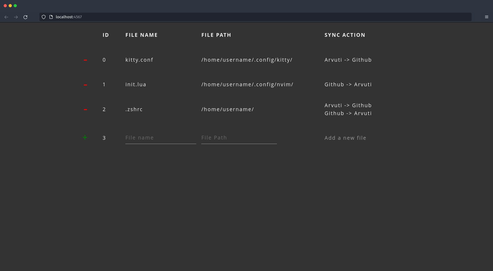
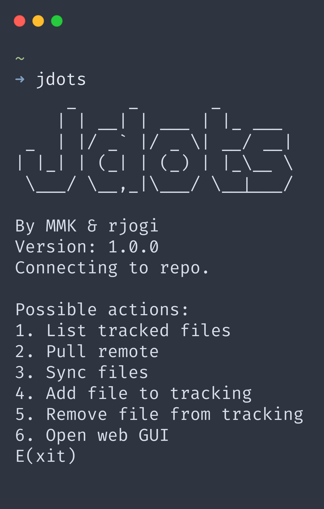

# <picture><source media="(prefers-color-scheme: light)" srcset="/riks-jogi/jdots/raw/master/assets/JdotsLogo_dark.png"></picture> [](https://jdots.j6gi.ee/?link=%2FTutvustus) [](https://github.com/riks-jogi/jdots/pulls) 

<p align="center">
  
  
</p>


## About The Project
Simply put, Jdots is a program for synchronising and quickly deploying configuration files (also called dotfiles).

We use a Git repo to synchronise the files between machines and our program takes care of the tedious copying and replacing files while keeping the user "in the loop" for important decisions.

Make these decisions how you want. CLI or GUI, which ever you prefer.

Every transaction is a Git commit so undoing mistakes or reverting to older versions is easy. (Right now this has to be done manually using Git)

## Usage

### Prerequisites

1. Local installation of:
    1. <a href="https://java.com/en/download/">Java</a> to run the app.
    2. <a href="https://git-scm.com/book/en/v2/Getting-Started-Installing-Git">Git</a> to sync files.
2. A git repo for your soon to be synced config files.
3. A <a href="https://docs.github.com/en/authentication/keeping-your-account-and-data-secure/creating-a-personal-access-token">personal access token</a> with "repo" permissions. **Save the token for later.**

### Installation

1. Make a new folder.
2. Download and move the latest release of Jdots into that folder.
3. Clone your config file repo to that folder. **Cloning with SSH is currently not supported.**
```sh
git clone https://github.com/your_username_/Project-Name.git
```
4. Rename the config file repo folder to ".data".
The folder you made at the start should now contain Jdots.jar and a folder named ".data" that is connected to your conf file repo.
5. Remember you forgot the personal access token and make another one.
6. Run Jdots.jar.

### Running
Running Jdots from a specific folder would be annoying. Currently the best option is to write a script to temporarily navigate to Jdots.jar's parent folder and run it there. The shell returns to the previous path when you exit Jdots. 
```sh
# Optional:
# Declare github username and auth token for ENV auth

# export GIT_USER=username
# export GIT_SECRET=secret

(cd /location/of/Jdots.jar && java -jar Jdots.jar)
```

## Roadmap

Features that we'd like to add in the future:
- Improved Git functionality
  - Revert back to earlier commits/versions
  - SSH authentication
- Headless CLI client
  - Ability to use CLI with relative paths
  - Periodic checks in the background
    - Notifying user when change is detected

## Contributing

Pull requests and issues are welcome and encouraged.

## License

Distributed under the Apache-2.0 License. See [LICENSE](https://github.com/riks-jogi/Jdots/blob/main/LICENSE.md) for more information.

## Authors

* [**Richard Jõgi**](https://github.com/riks-jogi) - *Comp Sci Student at Tartu University*
* [**Mihkel Martin Kasterpalu**](https://github.com/MihkelMK) - *Comp Sci Student at Tartu University*
